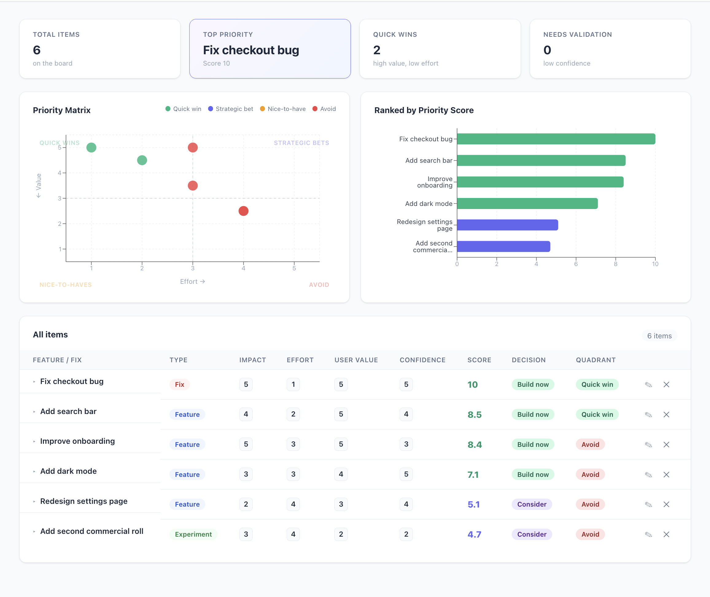
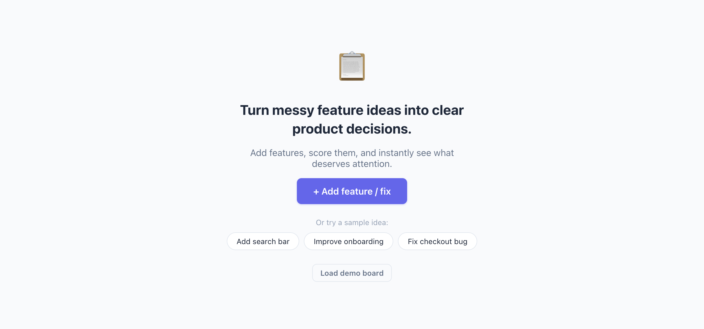
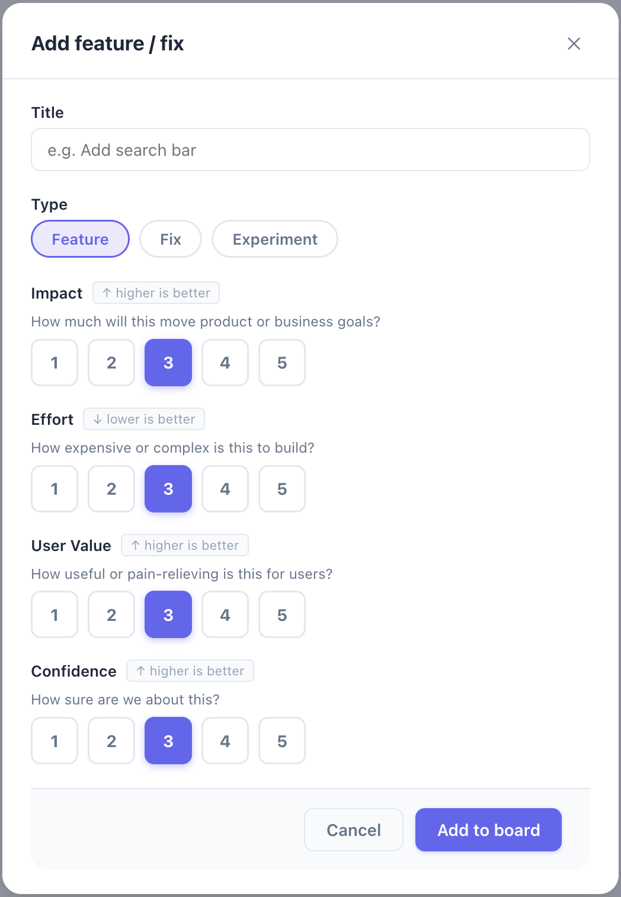

# Priority Board

Score features, see tradeoffs, decide faster.

<div align="center">
  
</div>

<br>

<div align="center">
  
  &nbsp;
  
</div>

<br>

A lightweight, client-side prioritization tool. Add features or fixes, score them across configurable metrics (Impact, Effort, User Value, Confidence), and get an instant ranked board with a priority matrix and decision labels.

All data is stored in `localStorage` — no backend, no accounts.

## Stack

- React 19
- Recharts (scatter + bar charts)
- Vite

## Getting started

```bash
npm install
npm run dev
```

## Features

- Customizable scoring framework (rename metrics, adjust weights, flip direction)
- Priority matrix (Value vs Effort quadrants)
- Ranked bar chart by priority score
- Per-item decision labels: Build now / Consider / Validate first / Park it
- Expandable row explanations
- Demo board to explore with sample data
